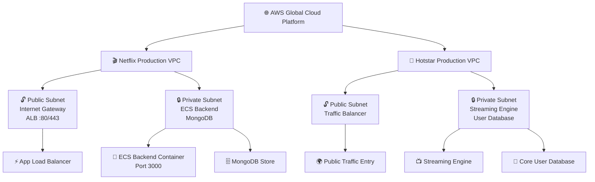
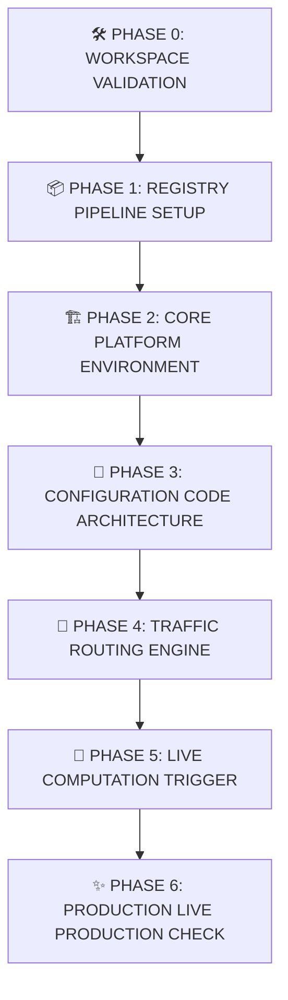

# 🚀 The Ultimate DevOps Guide: AWS Cloud & ECS Deployment

> A visually guided roadmap to take a containerized full-stack application from local development to a secure, production-ready AWS deployment.

---

## 🧭 Quick Navigation

- [Part 1: Local Setup & Configuration](#-part-1-local-setup--configuration)
- [Part 2: Container Storage & Compute Engine](#-part-2-container-storage--compute-engine)
- [Part 3: Network Separation, Isolation & Core Security](#-part-3-network-separation-isolation--core-security)
- [Part 4: Traffic Balancing, Logs & Execution Permissions](#-part-4-traffic-balancing-logs--execution-permissions)
- [Part 5: The Master Production Deployment Roadmap](#-part-5-the-master-production-deployment-roadmap)

---

## 🌟 What This Guide Covers

This guide covers everything required to take a containerized full-stack application and deploy it to a secure, enterprise-grade cloud environment using Amazon Web Services (AWS).

---

## 🛠️ Part 1: Local Setup & Configuration

<strong>1. AWS CLI (Command Line Interface)</strong>

- **English Definition:** A unified command-line utility provided by Amazon that enables developers to control, automate, and script interactions with all AWS cloud ecosystem services directly from a local terminal.
- **Real-World Analogy:** Think of this like using a Voice Assistant (like Google Assistant or Siri). Instead of opening a website, scrolling, and clicking buttons manually, you just say a command, and the task gets done instantly behind the scenes.
- **Hinglish Explanation:** Bhai, agar aapko baar-baar AWS ki website open karke manually setup nahi karna hai, aur aap chahte ho ki aap apne VS Code terminal se hi images push kar sako ya cloud servers track kar sako, toh uske liye AWS CLI install kiya jata hai.
- **Windows Setup:** Iske liye 64-bit Windows msi installer use karke simple installation hoti hai. Verify karne ke liye terminal me chalao: `aws --version`.

<strong>2. IAM Access Keys</strong>

- **English Definition:** Secure cryptographic credentials comprising an Access Key ID and a Secret Access Key used to authenticate programmatic requests sent from your local development environment to AWS.
- **Real-World Analogy:** This is exactly like your Net Banking Username and Password. Without these, no transactions or modifications can be safely authenticated.
- **Hinglish Explanation:** Programmatic access ke liye AWS Console ke IAM (Identity and Access Management) service me jaakar ek user banaya jata hai aur uske liye Access Key ID aur Secret Access Key generate kiye jaate hain. Yeh keys sirf ek hi baar dikhti hain, isiliye inka `.csv` file download karke hamesha safe rakhna hota hai.

<strong>3. Local Machine Linkage (aws configure)</strong>

- **English Definition:** The initial environment bootstrapper command executed locally to securely bind your cryptographic keys, default data formats, and geographic region maps to your host operational profile.
- **Real-World Analogy:** This is like filling out your Default Shipping Address and Login Info on an e-commerce application so you don't have to re-enter your details every single time you buy something.
- **Hinglish Explanation:** Apne terminal ko AWS account se link karne ke liye hum command chalate hain: `aws configure`. Yeh terminal me aapse 4 crucial details maangega:
  1. `AWS Access Key ID`
  2. `AWS Secret Access Key`
  3. `Default region name` (Jaise `us-east-1`)
  4. `Default output format` (`json`)
- **Where are these saved?** Windows me yeh keys security ke liye raw environment variables me nahi jaati, balki aapke system ke user path par hidden directory me save hoti hain: `C:\Users\YourUserName\.aws\`. Isme do files banti hain: `credentials` (keys ke liye) aur `config` (region aur formats ke liye).

---

## 📦 Part 2: Container Storage & Compute Engine

Once your local workspace is authenticated, you need a way to store your builds and compute them in an elastic execution environment.

<strong>4. ECR (Elastic Container Registry)</strong>

- **English Definition:** A fully managed, highly available, and secure private Docker container registry provided by AWS to host, manage, and pull containerized application images.
- **Real-World Analogy:** It's your Private Google Drive Folder. Docker Hub public hota hai jahan koi bhi image dekh sakta hai, par ECR aapki personal secure vault hai jahan aap apna proprietary code safe rakhte ho.
- **Hinglish Explanation:** ECR AWS ka apna private Docker Hub hai. Jab aap apne Full-Stack application (Frontend + Backend) ka local build banaoge, toh un Docker images ko cloud par save karne ke liye pehle ECR repository me push karna padega.

<strong>5. ECS (Elastic Container Service)</strong>

- **English Definition:** A highly scalable container orchestration engine managed by AWS that handles the initialization, scaling, health tracking, and structural life-cycle loops of production containers.
- **Real-World Analogy:** ECS acts like an enterprise Construction Project Manager. You hand over the blueprint layout, and the manager handles scheduling workers, monitoring shifts, and replacing anyone who goes down.
- **Hinglish Explanation:** Docker containers ko bare-metal infrastructure ke bina cloud par maintain aur run karne ki main master-service ka naam ECS hai. ECS ke andar 3 main core concepts hote hain:
  1. **Cluster:** Yeh ek isolated environment hai (jaise ek specific project directory) jahan aapke saare associated services aur tasks live execute hote hain.
  2. **Task Definition:** Yeh aapke container ka Blueprint / Recipe Book hai. Isme aap concrete rules likhte ho: Kaunsi ECR image pull karni hai, kitna CPU/RAM allocate karna hai, kaunse ports expose karne hain, aur environmental variables kya honge.
  3. **Service:** Yeh continuous runtime supervisor hai. Agar koi container crash ho jata hai, toh Service use pehchan kar instantly auto-restart kar deti hai taaki zero downtime mile.

<strong>6. AWS Fargate</strong>

- **English Definition:** A serverless compute engine purpose-built for containers that works directly with ECS, removing the operational overhead of provisioning, patch-managing, and scaling physical EC2 virtual servers.
- **Real-World Analogy:** Booking an Uber / Ride-Share. You do not care about the car's engine tuning, insurance tracking, or fuel refilling; you simply get in, pay for the distance travelled, and reach your destination.
- **Hinglish Explanation:** Pehle containers chalane ke liye cloud par khud virtual computer (EC2 instances) rent par lekar unhe updates aur security patches dene padte the. Par Fargate ke aane se server-management ka jhanjhat khatam. Aap bas ECS ko apni configuration batate ho, aur Fargate automatically resources deploy kar deta hai. Aapko sirf utne seconds ka bill dena hota hai jitne der aapka container actually active raha.

---

## 🌐 Part 3: Network Separation, Isolation & Core Security

Cloud infrastructure parameters require absolute segregation to prevent unauthorized breaches to sensitive production configurations.

<strong>7. VPC (Virtual Private Cloud)</strong>

- **English Definition:** A logically isolated virtual network partition dedicated strictly to your AWS cloud account that provides structural boundaries to define IP address ranges, subnets, and gateway routing tables.
- **Real-World Analogy:** A high-end Gated Luxury Society. Anyone can navigate outside the perimeter, but no random outsider can walk past the boundary lines without passing authorization verifications.
- **Hinglish Explanation:** VPC AWS cloud ke andar aapka ek private digital ilaqa hai. Is boundary wall ke andar aapke saare backend resources, database servers, aur APIs chalte hain, taaki bahaar ki public internet se koi direct malicious script aapke raw ecosystem ko access na kar sake.

<strong>8. Architectural Subnets (Public vs Private)</strong>

- **English Definition:** Subdivisions of a VPC IP range used to isolate backend logical infrastructure from public internet-facing ingress nodes.
  - **Public Subnet:** Connected directly to an Internet Gateway; hosts external load balancers.
  - **Private Subnet:** Isolated from raw internet access; hosts data nodes and application servers.
- **Real-World Analogy:**
  - **Public Subnet:** The society's Front Reception Area / Guard Room where delivery agents, guests, and open traffic interact.
  - **Private Subnet:** The resident's Personal Safe / Bedrooms located deep inside the apartment complex where entry is locked and highly restricted.
- **Hinglish Explanation:** Hum apne network code security ko maximum level par le jaane ke liye VPC ko do subnets me break karte hain. Public Subnet me un servers ko rakha jata hai jinka kaam public user requests accept karna hai (jaise Load Balancer). Aur Private Subnet me main critical applications (Backend API Engine, Database clusters) run hote hain, taaki unpar internet se koi direct structural attack na ho sake.

<strong>9. Isolating Distinct Environments (Netflix vs Hotstar Analogy)</strong>

When multiple corporate entities or disconnected applications deploy to the cloud, they are allocated completely separate VPC containers. They cannot sneak into each other's boundaries, keeping them strictly isolated from one another.

<strong>10. Security Groups (Stateful Firewalls)</strong>

- **English Definition:** A digital software-level virtual firewall wrapping directly around operational instances to monitor and control allowed inbound and outbound networking traffic protocols.
- **Real-World Analogy:** A Security Gatekeeper holding a strict guest list register. If your name and identity details are not present on the whitelist documentation, entry is automatically denied.
- **Hinglish Explanation:** Security Group ek dynamic rule-book firewall hai jo define karta hai ki kaunsa internal ya external system kis specific port par hamare resource se connect ho sakta hai. Production setups me security guidelines follow karne ke liye yeh standard configuration block use hota hai:

| Security Group Entity | Allowed Traffic Pattern Rule (Inbound Ingress) | Exposed Operational Port |
| :--- | :--- | :--- |
| **ALB Security Group** | Allowed from Anywhere (`0.0.0.0/0`) | HTTP (`80`) & HTTPS (`443`) |
| **ECS Task Security Group** | Traffic allowed ONLY if it routes through the ALB Security Group source | Dynamic / App Port (e.g., `3000`) |
| **Database Security Group** | Traffic allowed ONLY if it routes through the ECS Task Security Group source | DB Target Port (e.g., `27017` / `3306`) |

---

## 🚦 Part 4: Traffic Balancing, Logs & Execution Permissions

To scale applications under heavy structural load patterns, incoming connections must be handled correctly while logging execution states.

<strong>11. ALB (Application Load Balancer) & Target Groups</strong>

- **English Definition:** A high-throughput reverse-proxy traffic manager that distributes client application-layer requests across backend destination targets registered within an active configuration group.
- **Real-World Analogy:** A Restaurant Reception Host. As groups of hungry diners (Web Traffic) arrive, the host routes them evenly to open tables (Containers) and avoids sending anyone to tables that are currently being cleaned or repaired.
- **Hinglish Explanation:** ALB aapki application ke aage ek main traffic guard bankar khada hota hai. Jab lakho requests ek sath aati hain, toh ALB unhe distributed live ECS tasks par balance karke bhejta hai taaki server hang na ho.
  - **Path-Based Routing:** Iska use karke aap specify kar sakte ho ki agar URL route `/api/*` hai toh request automatic backend container par redirect ho jaye, aur standard paths frontend application cluster par chalein.
  - **Target Group:** Yeh active, healthy servers/containers ki ek registry list hoti hai. ALB is list me registered ports par regularly Health Checks ping bhejta hai taaki agar koi container dead ho gaya ho, toh user request ko wahan bhej kar application response break na ho.

<strong>12. IAM Tasks Execution Roles</strong>

- **English Definition:** Security authorization identities that grant AWS management containers implicit permissions to invoke specific system APIs on behalf of the developer.
- **Real-World Analogy:** A company-issued Master Keycard / Employee ID Card. Without swipe permissions, a technician cannot enter restricted file systems or download secure inventory boxes.
- **Hinglish Explanation:** AWS me binary protocols ke mutabik koi bhi resource bina explicit clearance ke aapas me coordinate nahi kar sakta. ECS services ko boot up hote waqt `ecsTaskExecutionRole` ki zaroorat padti hai taaki aapka cluster securely private ECR repositories se Docker images download kar sake aur application operational files ko access kar sake.

<strong>13. Amazon CloudWatch</strong>

- **English Definition:** A unified telemetry monitoring ecosystem designed to collect, query, and retain system infrastructure matrices along with centralized runtime container outputs (`console.log`).
- **Real-World Analogy:** The application's Flight Black Box / CCTV Surveillance System. If an unexpected runtime event occurs or the application crashes, engineers inspect these timestamped records to identify the cause.
- **Hinglish Explanation:** Jab aapka backend engine cloud par Fargate infrastructure ke andar live ho jata hai, tab aap vahan local terminal open karke logs nahi dekh sakte. Agar application backend me koi logical runtime issue ya syntax warning aati hai, toh use step-by-step debug karne ke liye hum CloudWatch Log Groups dashboard check karte hain jahan saare `console.log` data safe and centralized records me capture hote hain.

---

## 🗺️ Part 5: The Master Production Deployment Roadmap

When deploying a production-ready application pipeline from scratch to AWS ECS, execute actions using this sequential deployment loop:

### 🔄 Deployment Phases

- **PHASE 0: WORKSPACE VALIDATION**
  - Install local system AWS CLI drivers
  - Authenticate programmatic keys via `aws configure` terminal loops

- **PHASE 1: REGISTRY PIPELINE SETUP**
  - Provision Private ECR Repositories for separate application microservices
  - Tag local compilation targets and push Docker builds to ECR

- **PHASE 2: CORE PLATFORM ENVIRONMENT**
  - Establish the isolated target network workspace via VPC architectures
  - Configure Public/Private Subnets, Internet Gateways, and Security Rules
  - Initialize the logical orchestration anchor space (ECS Cluster)

- **PHASE 3: CONFIGURATION CODE ARCHITECTURE**
  - Script the Task Definition specifications (RAM allocation, Engine definitions)
  - Wire the Task Execution Identity Roles to permit logging/registry hooks

- **PHASE 4: TRAFFIC ROUTING ENGINE**
  - Provision Target Groups specifying application ingress ports & health checks
  - Setup Application Load Balancers inside public-facing network blocks

- **PHASE 5: LIVE COMPUTATION TRIGGER**
  - Spin up the active ECS Service pointing to the created Task Definition blueprints
  - Bind the Service to the Load Balancer targets to enable dynamic scalability

- **PHASE 6: PRODUCTION LIVE PRODUCTION CHECK**
  - Pull up the generated ALB DNS URL string and verify API responses!

---

## ✅ Final Takeaway

This guide transforms AWS deployment from a confusing cloud setup into a structured, layered blueprint covering identity, storage, networking, security, load balancing, and orchestration.
