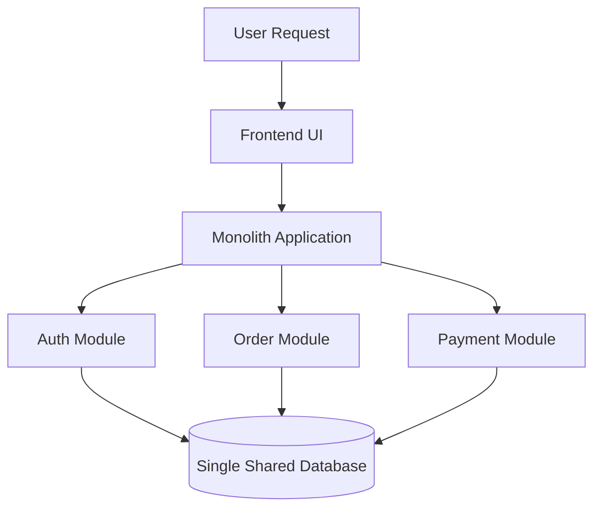
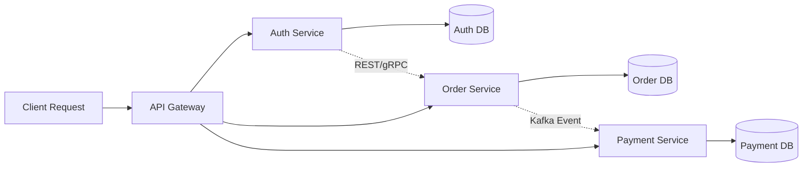
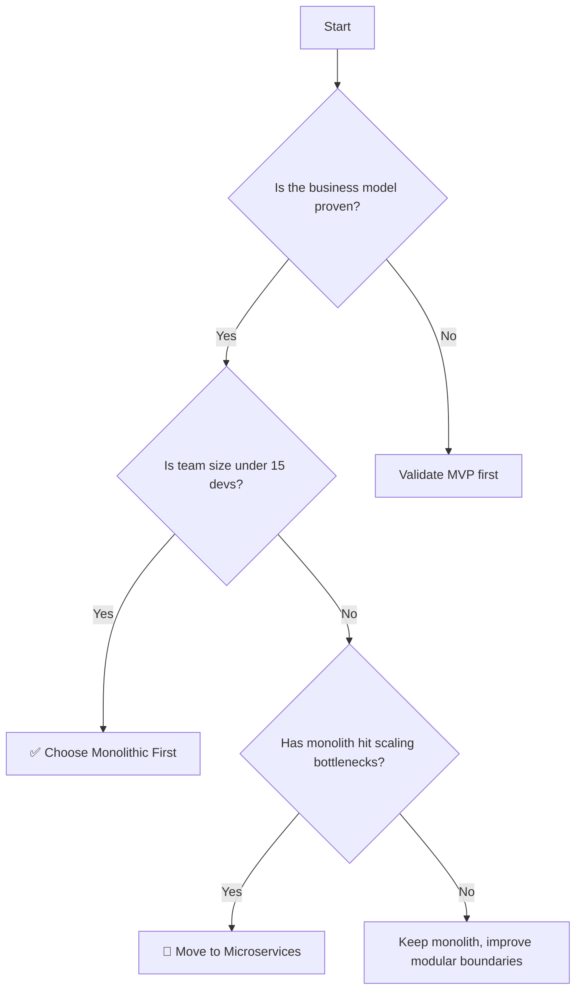

# 🧠 System Design Notes: Monolithic vs Microservices Architecture

> A modern architectural guide for understanding how software systems are built, scaled, and evolved.

<div class="hero-card">
  <div class="hero-glow"></div>
  <div class="hero-content">
    <h2>🏗️ Choose the right architecture with clarity</h2>
    <p>Monoliths give speed and simplicity. Microservices give flexibility and scale. The real art is knowing when to use which.</p>
  </div>
</div>

<div class="quick-nav">
  <span class="quick-pill">⚡ Fast Start</span>
  <span class="quick-pill">🧩 Modular Growth</span>
  <span class="quick-pill">📈 Scale When Needed</span>
</div>

<div class="info-grid">
  <div class="info-card">
    <h3>🏛️ Monolith</h3>
    <p>Best for early products, low complexity, and faster delivery.</p>
  </div>
  <div class="info-card">
    <h3>🚀 Microservices</h3>
    <p>Best for large systems, independent teams, and high-scale growth.</p>
  </div>
</div>

<details class="interactive-panel">
  <summary>🧭 Click to reveal the quick decision cheat sheet</summary>
  <div class="panel-body">
    <ul>
      <li>🧪 Start with a monolith if the idea is still being validated.</li>
      <li>🛠️ Keep modular boundaries even inside a monolith.</li>
      <li>📦 Move to microservices when deployment and scaling become painful.</li>
      <li>⚠️ Never share databases across microservices without a strong reason.</li>
    </ul>
  </div>
</details>

<style>
.hero-card {
  position: relative;
  overflow: hidden;
  border-radius: 18px;
  padding: 24px;
  margin: 20px 0 30px;
  background: linear-gradient(135deg, #0f172a, #1e3a8a, #2563eb);
  color: white;
  box-shadow: 0 12px 35px rgba(37, 99, 235, 0.25);
  animation: floatIn 1.2s ease-out;
}
.hero-glow {
  position: absolute;
  inset: -20px;
  background: radial-gradient(circle, rgba(255,255,255,0.18), transparent 55%);
  animation: pulseGlow 3s infinite alternate;
}
.hero-content {
  position: relative;
  z-index: 1;
}
.quick-nav {
  display: flex;
  flex-wrap: wrap;
  gap: 10px;
  margin: 16px 0 20px;
}
.quick-pill {
  display: inline-block;
  padding: 8px 12px;
  border-radius: 999px;
  background: #e0f2fe;
  color: #0f172a;
  font-weight: 600;
  box-shadow: 0 4px 10px rgba(14, 116, 144, 0.12);
  animation: popIn 0.7s ease;
}
.info-grid {
  display: grid;
  grid-template-columns: repeat(auto-fit, minmax(220px, 1fr));
  gap: 12px;
  margin: 18px 0 20px;
}
.info-card {
  border: 1px solid #dbeafe;
  border-radius: 14px;
  padding: 14px;
  background: linear-gradient(180deg, #f8fbff, #eef6ff);
}
.interactive-panel {
  border: 1px solid #bfdbfe;
  border-radius: 14px;
  padding: 12px 14px;
  background: #f8fbff;
  margin: 10px 0 24px;
}
.interactive-panel summary {
  cursor: pointer;
  font-weight: 700;
  color: #1d4ed8;
}
.panel-body {
  margin-top: 10px;
  padding-left: 6px;
}
@keyframes floatIn {
  from { transform: translateY(10px); opacity: 0; }
  to { transform: translateY(0); opacity: 1; }
}
@keyframes pulseGlow {
  from { transform: scale(0.95); opacity: 0.7; }
  to { transform: scale(1.05); opacity: 1; }
}
@keyframes popIn {
  from { transform: scale(0.96); opacity: 0.7; }
  to { transform: scale(1); opacity: 1; }
}
</style>

---

## 1. 🏛️ Monolithic Architecture (The Unified Kingdom)

### Core Technical Concept
- English definition: One single application built, compiled, and deployed as one unit.
- Real-world analogy: A smartphone — everything is packed into one device.
- Hinglish explanation: Frontend, backend, business logic, aur database connections sab ek hi codebase ke andar hote hain. Jab deploy karte ho, toh poori app ek hi server process ke roop mein chalta hai.

### How It Works
In a monolith, different modules talk directly through internal function calls, so there is no network delay between components.

```javascript
// Internal monolith function call
const userData = userService.getUserProfile(userId);
```

### Visual Diagram



### ✅ Advantages
- Simple deployment: one artifact, one process, one server
- Fast internal communication: in-memory function calls
- Easier end-to-end testing for small systems

### ❌ Disadvantages
- Single point of failure: one uncaught exception can crash the whole app
- Scaling is blunt: even one feature spike forces scaling the whole system
- Tech-stack lock-in: hard to mix very different technologies smoothly

---

## 2. 🚀 Microservices Architecture (The Decentralized Network)

### Core Technical Concept
- English definition: An app broken into independent, loosely coupled services, each owning a business capability.
- Real-world analogy: A food court where each stall has its own chef, kitchen, and inventory.
- Hinglish explanation: Ek badi application ko chhote independent services me tod diya jata hai. Har service ka apna codebase, apna deployment, aur apna database hota hai.

### How Services Communicate
- Synchronous: REST API or gRPC for request-response communication
- Asynchronous: Kafka or RabbitMQ for event-driven communication

```javascript
// Cross-service API call
const paymentStatus = await axios.post(
  'http://payment-service:5000/process',
  orderDetails
);
```

### Visual Diagram



### ✅ Advantages
- Independent deployments for each service
- Better fault isolation: one service can fail without taking down the whole app
- Flexible tech stack: each service can use the best tool for the job

### ❌ Disadvantages
- Much higher operational complexity
- Distributed systems need Docker, Kubernetes, CI/CD, monitoring, and observability
- Data consistency becomes harder across services

---

## 3. 📊 Side-by-Side Comparison

| Feature | Monolithic | Microservices |
|---|---|---|
| Codebase Layout | Single unified codebase | Multiple services with separate codebases |
| Deployment | One big deployment | Independent rolling deployments |
| Database Design | Shared database | Database per service |
| Scaling | Whole app scales together | Individual services scale independently |
| Team Structure | Great for small teams | Great for large, independent teams |
| Debugging | Faster and simpler | Requires centralized logs and tracing |

---

## 4. 🔀 Decision Flow: When to Choose What?



### Practical Rule of Thumb
- Start with a monolith if you need speed, simplicity, and low infrastructure cost.
- Move to microservices when the system becomes too large, complex, or hard to deploy as one unit.

> “Don’t build microservices just because they are trendy. Build them when the operational burden is justified by real scale.”

---

## 5. 💡 Production Golden Rules

1. Keep the initial architecture simple.
2. Build clean modular boundaries even inside a monolith.
3. Containerize early with Docker.
4. Avoid sharing databases across microservices.
5. Add observability before the system becomes hard to debug.

---

## 6. 🎯 Why This Matters

- Monoliths are excellent for fast delivery and early-stage products.
- Microservices shine when the system grows into a distributed platform.
- The real winner is not the architecture label — it is the one that fits the team, the product, and the scale.

---

## 7. ✨ Unique Takeaway

This architecture story is special because it shows:
- an interactive decision flow,
- real code-level implementation examples,
- a clear warning about database-per-service isolation,
- and a practical mindset for choosing the right path in real-world engineering.
