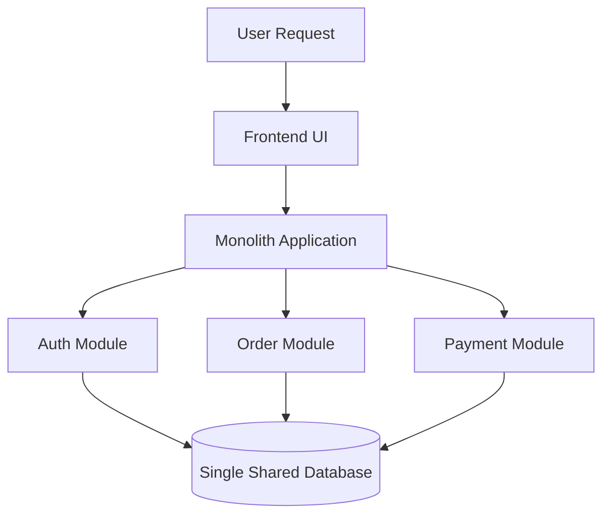
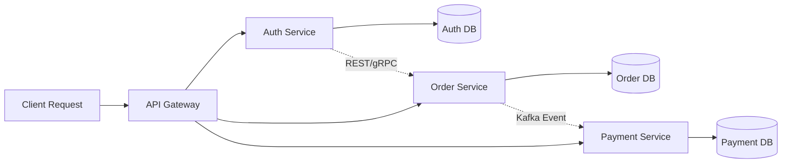
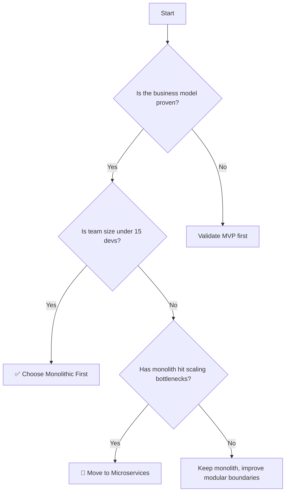

# 🧠 System Design Notes: Monolithic vs Microservices Architecture

> A modern architectural guide for understanding how software systems are built, scaled, and evolved.

<div class="hero-card">
  <div class="hero-glow"></div>
  <div class="hero-content">
    <h2>🏗️ Choose the right architecture with clarity</h2>
    <p>Monoliths give speed and simplicity. Microservices give flexibility and scale. The real art is knowing when to use which.</p>
    <div class="chip-row">
      <span class="chip">⚡ Fast to start</span>
      <span class="chip">📈 Built for scale</span>
      <span class="chip">🧠 Decision-driven</span>
    </div>
  </div>
</div>

<style>
body {
  animation: pageFade 0.8s ease;
}
.hero-card {
  position: relative;
  overflow: hidden;
  border-radius: 20px;
  padding: 24px;
  margin: 20px 0 30px;
  background: linear-gradient(135deg, #020617, #1d4ed8, #38bdf8);
  color: white;
  box-shadow: 0 16px 45px rgba(56, 189, 248, 0.25);
  animation: floatIn 1.2s ease-out, heroPulse 4.5s ease-in-out infinite;
}
.hero-card::before,
.hero-card::after {
  content: "";
  position: absolute;
  border-radius: 50%;
  background: rgba(255,255,255,0.12);
  filter: blur(8px);
  animation: orbit 6s linear infinite;
}
.hero-card::before {
  width: 140px;
  height: 140px;
  top: -40px;
  right: -30px;
}
.hero-card::after {
  width: 120px;
  height: 120px;
  bottom: -35px;
  left: -20px;
  animation-direction: reverse;
}
.hero-glow {
  position: absolute;
  inset: -20px;
  background: radial-gradient(circle, rgba(255,255,255,0.2), transparent 55%);
  animation: pulseGlow 3s ease-in-out infinite alternate;
}
.hero-content {
  position: relative;
  z-index: 1;
}
.hero-content h2 {
  animation: slideIn 0.9s ease both;
}
.hero-content p {
  animation: fadeUp 1.1s ease 0.2s both;
}
.chip-row {
  display: flex;
  flex-wrap: wrap;
  gap: 10px;
  margin-top: 14px;
}
.chip {
  padding: 7px 12px;
  border-radius: 999px;
  background: rgba(255,255,255,0.16);
  backdrop-filter: blur(8px);
  animation: chipBounce 1s ease both;
}
.chip:nth-child(2) { animation-delay: 0.15s; }
.chip:nth-child(3) { animation-delay: 0.25s; }
h1, h2, h3 {
  animation: titleGlow 2s ease-in-out infinite alternate;
}
ul li {
  animation: listPop 0.6s ease both;
}
ul li:nth-child(2) { animation-delay: 0.08s; }
ul li:nth-child(3) { animation-delay: 0.16s; }
pre, code {
  animation: codeGlow 2.2s ease-in-out infinite alternate;
}
.animated-table tr {
  animation: rowFade 0.8s ease both;
}
.animated-table tr:nth-child(2) { animation-delay: 0.08s; }
.animated-table tr:nth-child(3) { animation-delay: 0.16s; }
.animated-table tr:nth-child(4) { animation-delay: 0.24s; }
.animated-table tr:nth-child(5) { animation-delay: 0.32s; }
.animated-table tr:nth-child(6) { animation-delay: 0.4s; }
@keyframes pageFade {
  from { opacity: 0; transform: translateY(4px); }
  to { opacity: 1; transform: translateY(0); }
}
@keyframes floatIn {
  from { transform: translateY(12px); opacity: 0; }
  to { transform: translateY(0); opacity: 1; }
}
@keyframes heroPulse {
  0%, 100% { transform: translateY(0px); }
  50% { transform: translateY(-4px); }
}
@keyframes pulseGlow {
  from { transform: scale(0.95); opacity: 0.8; }
  to { transform: scale(1.05); opacity: 1; }
}
@keyframes orbit {
  from { transform: rotate(0deg) translateX(0px); }
  to { transform: rotate(360deg) translateX(0px); }
}
@keyframes slideIn {
  from { transform: translateX(-10px); opacity: 0; }
  to { transform: translateX(0); opacity: 1; }
}
@keyframes fadeUp {
  from { transform: translateY(8px); opacity: 0; }
  to { transform: translateY(0); opacity: 1; }
}
@keyframes chipBounce {
  from { transform: translateY(6px); opacity: 0; }
  to { transform: translateY(0); opacity: 1; }
}
@keyframes listPop {
  from { transform: translateX(-6px); opacity: 0; }
  to { transform: translateX(0); opacity: 1; }
}
@keyframes codeGlow {
  from { box-shadow: 0 0 0 rgba(56,189,248,0.15); }
  to { box-shadow: 0 0 10px rgba(56,189,248,0.25); }
}
@keyframes rowFade {
  from { opacity: 0; transform: translateY(4px); }
  to { opacity: 1; transform: translateY(0); }
}
@keyframes titleGlow {
  from { text-shadow: 0 0 0 rgba(255,255,255,0.06); }
  to { text-shadow: 0 0 10px rgba(56,189,248,0.3); }
}
</style>

---

## 1. 🏛️ Monolithic Architecture (The Unified Kingdom)

### Core Technical Concept
- English definition: One single application built, compiled, and deployed as one unit.
- Real-world analogy: A smartphone — everything is packed into one device.
- Hinglish explanation: Frontend, backend, business logic, aur database connections sab ek hi codebase ke andar hote hain. Jab deploy karte ho, toh poori app ek hi server process ke roop mein chalta hai.

### How It Works
In a monolith, different modules talk directly through internal function calls, so there is no network delay between components.

```javascript
// Internal monolith function call
const userData = userService.getUserProfile(userId);
```

### Visual Diagram



### ✅ Advantages
- Simple deployment: one artifact, one process, one server
- Fast internal communication: in-memory function calls
- Easier end-to-end testing for small systems

### ❌ Disadvantages
- Single point of failure: one uncaught exception can crash the whole app
- Scaling is blunt: even one feature spike forces scaling the whole system
- Tech-stack lock-in: hard to mix very different technologies smoothly

---

## 2. 🚀 Microservices Architecture (The Decentralized Network)

### Core Technical Concept
- English definition: An app broken into independent, loosely coupled services, each owning a business capability.
- Real-world analogy: A food court where each stall has its own chef, kitchen, and inventory.
- Hinglish explanation: Ek badi application ko chhote independent services me tod diya jata hai. Har service ka apna codebase, apna deployment, aur apna database hota hai.

### How Services Communicate
- Synchronous: REST API or gRPC for request-response communication
- Asynchronous: Kafka or RabbitMQ for event-driven communication

```javascript
// Cross-service API call
const paymentStatus = await axios.post(
  'http://payment-service:5000/process',
  orderDetails
);
```

### Visual Diagram



### ✅ Advantages
- Independent deployments for each service
- Better fault isolation: one service can fail without taking down the whole app
- Flexible tech stack: each service can use the best tool for the job

### ❌ Disadvantages
- Much higher operational complexity
- Distributed systems need Docker, Kubernetes, CI/CD, monitoring, and observability
- Data consistency becomes harder across services

---

## 3. 📊 Side-by-Side Comparison

<table class="animated-table">
  <tr>
    <th>Feature</th>
    <th>Monolithic</th>
    <th>Microservices</th>
  </tr>
  <tr>
    <td>Codebase Layout</td>
    <td>Single unified codebase</td>
    <td>Multiple services with separate codebases</td>
  </tr>
  <tr>
    <td>Deployment</td>
    <td>One big deployment</td>
    <td>Independent rolling deployments</td>
  </tr>
  <tr>
    <td>Database Design</td>
    <td>Shared database</td>
    <td>Database per service</td>
  </tr>
  <tr>
    <td>Scaling</td>
    <td>Whole app scales together</td>
    <td>Individual services scale independently</td>
  </tr>
  <tr>
    <td>Team Structure</td>
    <td>Great for small teams</td>
    <td>Great for large, independent teams</td>
  </tr>
  <tr>
    <td>Debugging</td>
    <td>Faster and simpler</td>
    <td>Requires centralized logs and tracing</td>
  </tr>
</table>

---

## 4. 🔀 Decision Flow: When to Choose What?



### Practical Rule of Thumb
- Start with a monolith if you need speed, simplicity, and low infrastructure cost.
- Move to microservices when the system becomes too large, complex, or hard to deploy as one unit.

> “Don’t build microservices just because they are trendy. Build them when the operational burden is justified by real scale.”

---

## 5. 💡 Production Golden Rules

1. Keep the initial architecture simple.
2. Build clean modular boundaries even inside a monolith.
3. Containerize early with Docker.
4. Avoid sharing databases across microservices.
5. Add observability before the system becomes hard to debug.

---

## 6. 🎯 Why This Matters

- Monoliths are excellent for fast delivery and early-stage products.
- Microservices shine when the system grows into a distributed platform.
- The real winner is not the architecture label — it is the one that fits the team, the product, and the scale.

---

## 7. ✨ Unique Takeaway

This architecture story is special because it shows:
- an interactive decision flow,
- real code-level implementation examples,
- a clear warning about database-per-service isolation,
- and a practical mindset for choosing the right path in real-world engineering.
